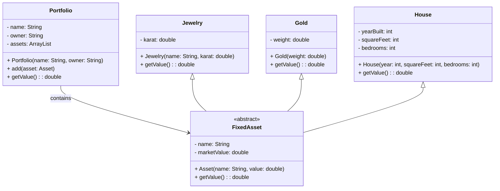

```mermaid
classDiagram
    class Portfolio {
        - name: String
        - owner: String
        - assets: ArrayList<Asset>
        + Portfolio(name: String, owner: String)
        + add(asset: Asset)
        + getValue(): double
    }

    class FixedAsset {
        <<abstract>>
        - name: String
        - marketValue: double
        + Asset(name: String, value: double)
        + getValue(): double
    }

    class Jewelry {
        - karat: double
        + Jewelry(name: String, karat: double)
        + getValue(): double
    }

    class Gold {
        - weight: double
        + Gold(weight: double)
        + getValue(): double
    }

    class House {
        - yearBuilt: int
        - squareFeet: int
        - bedrooms: int
        + House(year: int, squareFeet: int, bedrooms: int)
        + getValue(): double
    }

    Portfolio --> FixedAsset: contains
    Jewelry <|-- FixedAsset
    Gold <|-- FixedAsset
    House <|-- FixedAsset
```